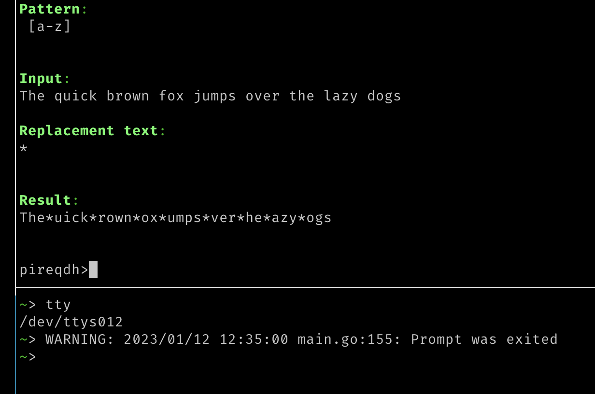

# Regular Expression Command

A simple console regular expression REPL based on Go

## Compile

    go build -o regex cmd/retool/main.go

## Running

Getting help:

    ./regex --help
    
Overwriting defaults and printing a result:

    ./regex --patern "<pattern>" --input "<text>" --replace "<replace>"

Interactive mode:

    ./regex --interactive

Sending standard errors some where, like another TMUX pannel

    ./regex --interactive 2> /dev/<tty-name>

## Interactive mode

The interface will divide the console into 5 sections
* Pattern
* Input
* Replacement text
* Result
* command

Thte first 3 can be modified by typing text in the command line prefixed by the
name of the section you want to update. For example:

    pattern new-pattern-here

You only need to type in as much of the section name as is needed to make it
unique. The prompt is made up of the first letter of all the commands you can use.

* p - pattern text
* i - input text
* r - replacement text
* e - exit
* q - quit
* d - dump - output everything to the console and exit
* h - help - online help, press enter to get out
* `enter` - redraw

The command prompt is a readline like interface, use up/down arrows to browse
previous commands and tab for completion.

Interactive mode also assumes your running on a modern like terminal emulator that supports color and the moving of a curser.

---

Written for NASA to assist in my work with NASA
Licence: What ever the default license is for NASA, assumed to be Public Domain.
